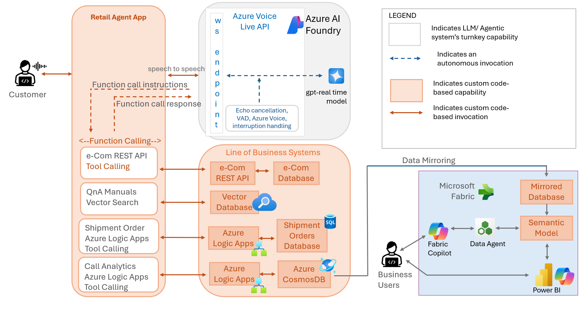
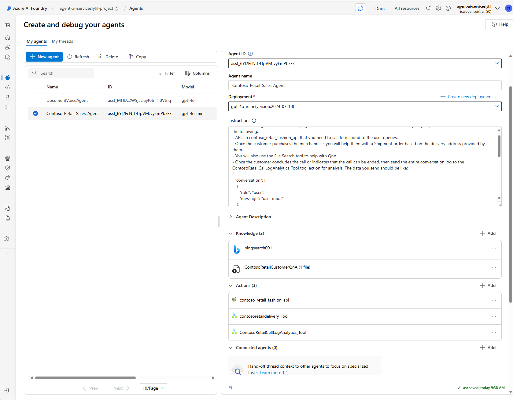
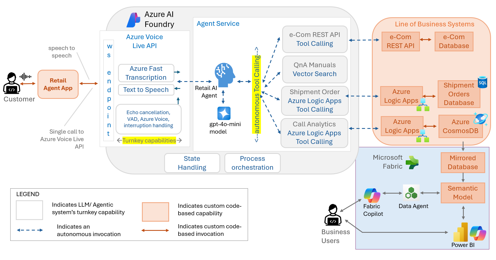
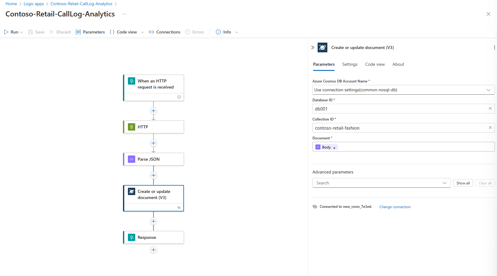
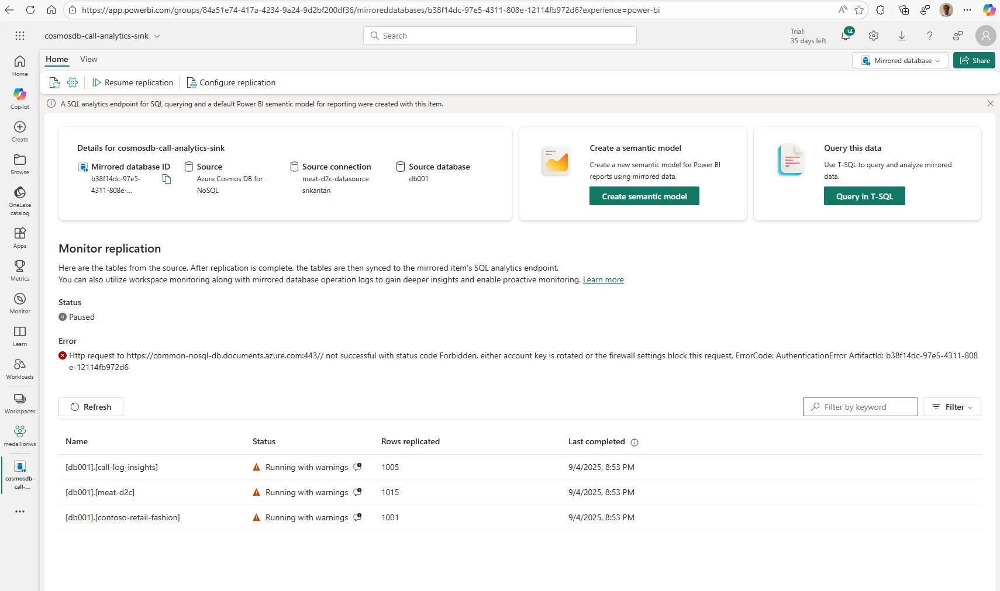
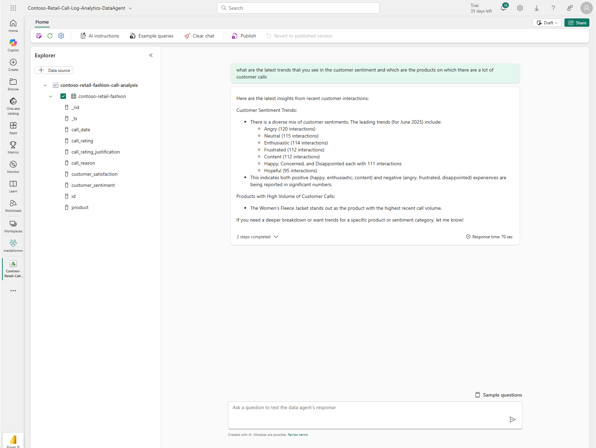
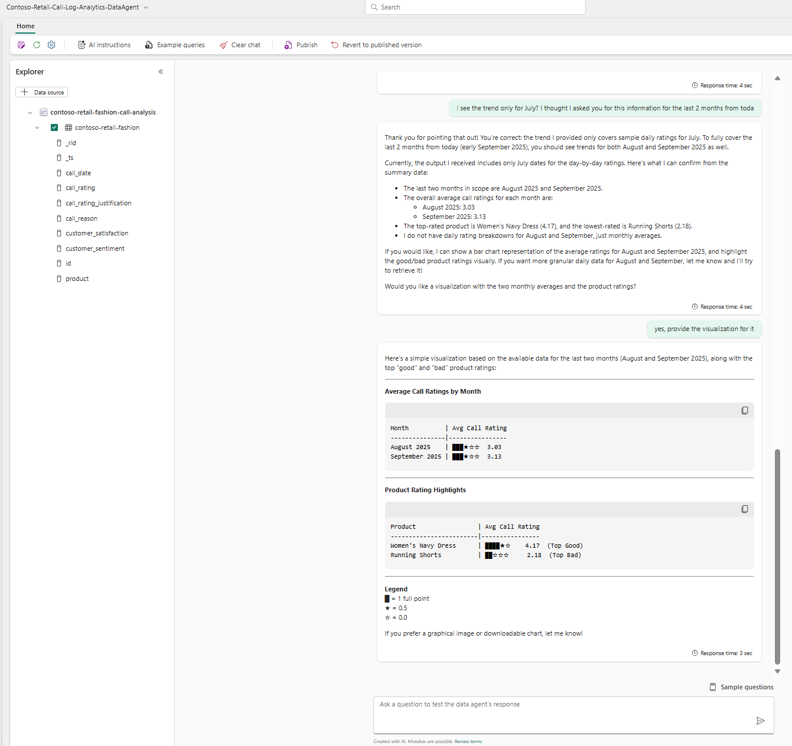
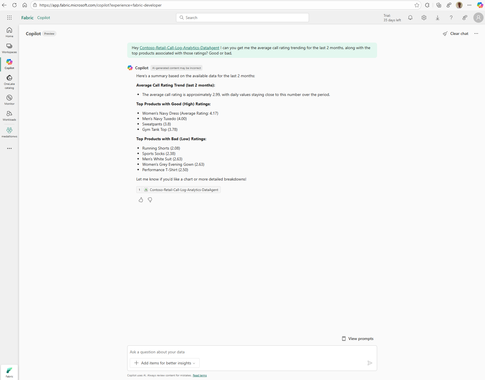
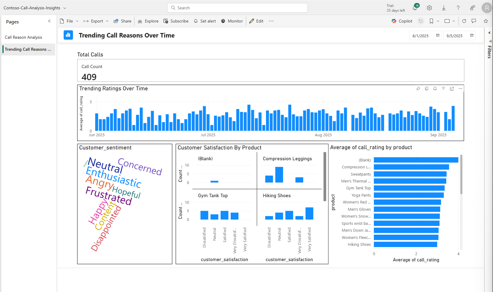
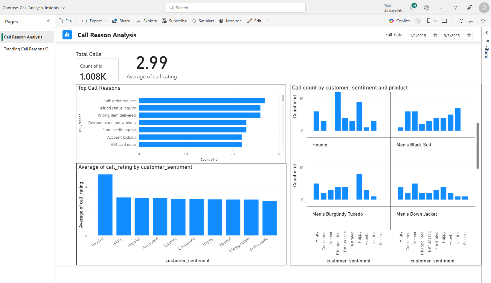

# Contoso Retail Assistant — Azure Voice Live API Integration Demo

A demonstration of Speech to Speech scenarios using Azure Voice Live API integration. It showcases **two distinct approaches** for building voice-enabled AI assistants. One that uses direct model integration (GPT-Realtime) in Azure AI Foundry, and the other uses an Agent in Azure AI Foundry Agent Service.

It also covers how the Voice Agent can be extended to support Call log analytics, extraction of insights, trends. It uses Microsoft Fabric's turnkey ability to mirror data from an OLTP Database (Azure CosmosDB) into OneLake, use Data Agents to reason over this data to obtain insights and trends. Business users can use the Copilot in Microsoft Fabric to reason over this data, and finally use Power BI to create interactive charts and reports

## 📋 Table of Contents

1. [Overview](#-overview)
2. [🎯 Approach 1: Direct Model Integration (GPT-Realtime)](#-approach-1-direct-model-integration-gpt-realtime)
   - [Introduction & Use Cases](#introduction--use-cases)
   - [Architecture & Components](#architecture--components)
   - [Setup & Configuration](#setup--configuration)
   - [Key Features](#key-features)
   - [Code Artifacts](#code-artifacts)
3. [🤖 Approach 2: Azure AI Foundry Agent Integration](#-approach-2-azure-ai-foundry-agent-integration)
   - [Introduction & Use Cases](#introduction--use-cases-1)
   - [Architecture & Components](#architecture--components-1)
   - [Setup & Configuration](#setup--configuration-1)
   - [Key Features](#key-features-1)
   - [Code Artifacts](#code-artifacts-1)
4. [🛍️ Shared Use Case & Business Features](#️-shared-use-case--business-features)
5. [📊 Call Analytics & Business Intelligence](#-call-analytics--business-intelligence)
6. [🔒 Security & Compliance](#-security--compliance)
7. [🔄 Version History](#-version-history)

**Choose Your Integration Path:**
- 🎯 **Direct Model Integration**: For real-time speech-to-speech applications with custom function calling
- 🤖 **Agent Integration**: For scenarios with existing Azure AI Foundry Agents, and wrap them with Azure Voice Live API incurring zero code change in the Agents themselves

---

# 🎯 Approach 1: Direct Model Integration (GPT-Realtime)

## Introduction & Use Cases

This approach provides **direct integration** with Azure Voice Live API using GPT-Realtime model for immediate speech-to-speech conversational experiences. It's designed for applications that require ultra-low latency and custom function calling implementation.

### Perfect For:
- **Voice-First Applications**: Real-time speech interfaces where latency is critical
- **Custom Function Logic**: Scenarios requiring client-side control over tool execution
- **Immediate Responses**: Applications where speech-to-speech conversion must be instantaneous. There is no STT or TTS involved.
- **Use Azure Voice**: Choose custom voices in Azure Speech Services that would not otherwise be available when using gpt-realtime API directly.
- **Development Flexibility**: Projects needing direct model parameter control
- **Multi-Language Support**: Applications requiring Indic language capabilities (en-IN, hi-IN), through custom Voice in Azure Speech Services

## Architecture & Components

Refer to the diagram below




### Core Components:
- **GPT-Realtime Model**: Direct audio-to-audio processing without transcript intermediation
- **Function Calling Engine**: Client-side implementation for tool execution
- **Azure Speech Voice**: High-quality TTS synthesis for response audio
- **WebSocket Communication**: Real-time bidirectional audio streaming
- **Voice Activity Detection**: Server-side VAD for natural conversation flow

## Setup & Configuration

### Prerequisites:
- Azure Voice Live API access with GPT-Realtime model support
- Python 3.10+ environment
- Azure CLI authentication (DefaultAzureCredential)

### Environment Configuration:
Create a `.env` file with:
```env
# Direct Model Integration Configuration
AZURE_VOICE_LIVE_ENDPOINT=your_voice_live_endpoint
AZURE_VOICE_LIVE_API_VERSION=2025-05-01-preview
VOICE_LIVE_MODEL=your_gpt_realtime_model_id
```

### Installation & Running:
```bash
# Install dependencies
pip install -r requirements.txt

# Run the GPT-Realtime Speech-to-Speech interface
chainlit run model_app.py
```

### 2. Authentication

Sign in for AAD token (one of):
- Azure CLI: `az login`
- Managed identity or VS Code/Azure sign-in also works with DefaultAzureCredential

## Key Features

### Speech Processing:
- **🎙️ Direct Speech-to-Speech**: Immediate audio-to-audio conversion via GPT-Realtime
- **⚡ Ultra-Low Latency**: Minimal delay for real-time conversation flow
- **�️ Server-Side VAD**: Configurable voice activity detection (threshold: 0.5)
- **🔊 Azure Speech Voice**: High-quality TTS with customizable voice parameters

### Function Calling:
- **🔧 Client-Side Implementation**: Full control over function execution logic
- **⚙️ Dynamic Tool Execution**: Real-time function parameter extraction and validation
- **�️ Custom Business Logic**: Retail-specific tools (product search, ordering, shipment)
- **📊 Function Response Integration**: Seamless integration of tool results into conversation

### Audio Configuration:
- **Sampling Rate**: 24kHz for high-quality audio processing
- **Turn Detection**: Server VAD with 300ms prefix padding, 500ms silence duration
- **Audio Format**: Real-time PCM16 streaming
- **Noise Processing**: Built-in noise suppression and echo cancellation

## Code Artifacts

### Core Files:
- **`model_app.py`**: Chainlit UI for GPT-Realtime interaction
  - Real-time audio streaming management
  - Session tracking and conversation state
  - Audio chunk processing and playback
  - Conversation interruption handling

- **`voicelive_modelclient.py`**: Direct Azure Voice Live API client
  - WebSocket connection management
  - GPT-Realtime model integration
  - Function calling implementation
  - Event processing and audio handling

- **`tools.py`**: Function definitions and execution logic
  - Product search and catalog APIs
  - Order management and processing
  - Shipment creation and tracking
  - Customer service and support tools

### Key Implementation Details:
```python
# Example: Direct model configuration
session_config = {
            "input_audio_sampling_rate": 24000,
            "instructions": system_instructions,
            "turn_detection": {
                "type": "server_vad",
                "threshold": 0.5,
                "prefix_padding_ms": 300,
                "silence_duration_ms": 500,
            },
            "tools": tools_list,
            "tool_choice": "auto",
            "input_audio_noise_reduction": {"type": "azure_deep_noise_suppression"},
            "input_audio_echo_cancellation": {"type": "server_echo_cancellation"},
            "voice": {
                "name": "en-IN-AartiIndicNeural",
                "type": "azure-standard",
                "temperature": 0.8,
            },
            "input_audio_transcription": {"model": "whisper-1"},
        }
```

---

## 🎥 Live Demo

**Watch the Voice-Enabled Application in Action**

Click the image below to see a live demonstration of the Azure AI Foundry Agent with voice capabilities. This demo showcases real-time speech-to-text processing, intelligent agent responses, and seamless voice interactions in a retail e-commerce scenario.

[](https://youtu.be/gceQPFiTBwU)


# 🤖 Approach 2: Azure AI Foundry Agent Integration

## Introduction & Use Cases

This approach leverages through Azure Voice Live API, providing enterprise-grade voice capabilities over existing Azure AI Foundry Service Agents. The Agents themselves are built regardless of Speech, and the Azure Voice Live API forms a clean wrapper over them. The Agent capabilities like autonomous tool execution and business logic, State Management, Memory Management continue to be available through the Voice integration.

### Perfect For:
- **Enterprise Deployments**: Organizations with existing Azure AI Foundry investments
- **Autonomous Operations**: Scenarios where Agents should handle business logic independently
- **Multi-Language Support**: Applications requiring Indic language capabilities (en-IN, hi-IN)
- **Governance & Compliance**: Enterprise scenarios requiring centralized Agent management


## Architecture & Components

The architecture with this approach is as below. Note that for the calling application the overall experience is based on Speech to Speech interaction. Internally, however, the Azure Voice Live API uses STT and TTS to/from the Model.



### Core Components:
- **Azure Fast Transcript**: Advanced multi-language speech-to-text processing
- **Azure AI Foundry Agent**: Pre-configured Agent with autonomous capabilities
- **GPT-4o-mini Model**: Agent-configured model for text processing
- **Neural Voice Synthesis**: Indic language optimized TTS (en-IN-AartiIndicNeural)
- **Semantic VAD**: Azure semantic voice activity detection

## Setup & Configuration

### Prerequisites:
- Azure AI Foundry project with configured Agent
- Azure Voice Live API access
- Agent with retail tools and business logic pre-configured
- Python 3.10+ environment

### Environment Configuration:
Create a `.env` file with:
```env
# Azure AI Foundry Agent Configuration
AZURE_VOICE_LIVE_ENDPOINT=your_voice_live_endpoint
AZURE_VOICE_LIVE_API_VERSION=2025-05-01-preview
AI_FOUNDRY_PROJECT_NAME=your_ai_foundry_project_name
AI_FOUNDRY_AGENT_ID=your_configured_agent_id
```
Note that there is no model name specified in the above. The Agent in Agent Service in Azure AI Foundry is already associated with a Model.

### Installation & Running:
```bash
# Install dependencies
pip install -r requirements.txt

# Run the Agent-based voice interface
chainlit run agent_app.py
```
### 2. Authentication

Sign in for AAD token (one of):
- Azure CLI: `az login`
- Managed identity or VS Code/Azure sign-in also works with DefaultAzureCredential

### Azure AI Foundry Agent Configuration:
Configure your Agent with the following system prompt:
```
You are an AI Agent tasked with helping the customers of Contoso retail fashions with their shopping requirements. You have access to the following:
- APIs in contoso_retail_fashion_api that you need to call to respond to the user queries. 
- Once the customer purchases the merchandise, you will help them with a Shipment order based on the delivery address provided by them. 
- You will also use the File Search tool to help with QnA
- Once the customer concludes the call or indicates that the call can be ended, then send the entire conversation log to the ContosoRetailCallLogAnalytics_Tool tool action for analysis.
```

## Key Features

### Language & Voice Capabilities:
- **🌍 Multi-Language Support**: Optimized for English (India) and Hindi (India)
- **🗣️ Neural Voice Synthesis**: en-IN-AartiIndicNeural for natural-sounding speech
- **📝 Azure Fast Transcript**: Advanced speech recognition with Indic language support
- **🎯 Semantic VAD**: Intelligent voice activity detection with end-of-utterance detection

### Agent Integration:
- **🤖 Autonomous Operation**: Agent handles all tool execution without client-side function calling
- **🧠 GPT-4o-mini Processing**: Leverages Agent-configured model capabilities
- **🏢 Enterprise Ready**: Built for complex business workflows and governance
- **🛠️ Pre-configured Tools**: Agent comes with retail business logic pre-implemented

### Audio Configuration:
- **Sampling Rate**: 24kHz with Azure Fast Transcript processing
- **Turn Detection**: Azure semantic VAD (threshold: 0.3, 200ms padding, 200ms silence)
- **Voice Settings**: en-IN-AartiIndicNeural with temperature 0.8
- **Audio Processing**: Deep noise suppression and server echo cancellation

## Code Artifacts

### Core Files:
- **`agent_app.py`**: Chainlit UI for Azure AI Foundry Agent interaction
  - Agent-based conversation management
  - Multi-language session handling
  - Real-time transcript display
  - Audio streaming for Agent responses

- **`voicelive_client.py`**: Azure AI Foundry Agent integration client
  - Agent WebSocket communication
  - Azure Fast Transcript integration
  - Multi-language voice configuration
  - Agent response processing

### Key Implementation Details:
```python
# Example: Agent integration configuration
session_config = {
            "input_audio_sampling_rate": 24000,
            "turn_detection": {
                "type": "azure_semantic_vad",
                "threshold": 0.3,
                "prefix_padding_ms": 200,
                "silence_duration_ms": 200,
                "remove_filler_words": False,
                "end_of_utterance_detection": {
                    "model": "semantic_detection_v1",
                    "threshold": 0.01,
                    "timeout": 2,
                },
            },
            "input_audio_noise_reduction": {"type": "azure_deep_noise_suppression"},
            "input_audio_echo_cancellation": {"type": "server_echo_cancellation"},
            "voice": {
                "name": "en-IN-AartiIndicNeural",
                "type": "azure-standard",
                "temperature": 0.8,
            },
            "input_audio_transcription": {"model": "azure-speech", "language": "en-IN, hi-IN"},
        }
```

### Agent Configuration Screenshot:


## 🎬 Configuration Walkthrough

**Azure AI Foundry Agent Setup Guide**

The video below walks through the step-by-step configuration of the Agent in Azure AI Foundry Agent Services. This comprehensive tutorial covers the entire setup process including model configuration, tool integration, and deployment settings.

[](https://youtu.be/3MToU8c6Aks)

---


# 🛍️ Shared Use Case & Business Features

Both integration approaches support the same retail assistant capabilities, providing a consistent business experience regardless of the technical implementation chosen.

## Core Shopping Features:
- **Shopping questions**: Answer queries about searching products based on category name
- **Order Management**: Place orders
- **Vector-Powered File Search**: QnA on order processing, returns, payment issues, and policies

## Advanced Automation Features:
- **Automated Shipment Creation**: After order placement, automatically creates shipment orders by:
  - Requesting delivery address from the user
  - Calling Azure Logic App that creates Shipment Order in Azure SQL Database
  - Providing shipment tracking information

- **Intelligent Conversation Analytics**: Autonomous conversation analysis by:
  - Capturing entire user conversation context
  - Sending conversation data to Azure Logic App powered by GPT-4o
  - Performing comprehensive analysis including:
    - Key conversation information extraction
    - Customer sentiment analysis
    - Agent performance evaluation
  - Storing analytics data in Azure Cosmos DB for business insights

## Example Queries (Supported by Both Approaches):
- "What are the products in Winter wear?"
- "What are the products in Active Wear?"
- "I want to order 5 numbers of Product ID 24"
- "What is your return policy?"
- "How do I track my shipment?"
- "I need help with payment issues"


# 📊 Call Analytics & Business Intelligence

*This analytics system works with both integration approaches, providing enterprise-grade conversation insights regardless of whether you use Direct Model Integration or Azure AI Foundry Agent Integration.*

## Call Log Analytics Configuration

The conversation analytics feature uses a separate Azure Logic App with GPT-4o to analyze call quality and extract insights. This Logic App uses the following system prompt and function schema:



### Call Log Evaluation System Prompt:
```
You are a Call Center Quality Evaluator AI for Contoso Retail, a fashion and apparel company.

[Your Task]
- Analyze the customer service call transcript and extract the following parameters: call_reason, product, customer_satisfaction, customer_sentiment, call_rating (1–5), call_rating_justification, and call_date.

[Evaluation Guidelines]
- Judge the call based on tone, language, and resolution of the issue.
- Identify the fashion/apparel product discussed if applicable (e.g., Men's Shirts, Women's Dresses, Shoes, Accessories, etc.) - this field can be null for general inquiries.
- If the customer is frustrated, confused, or expresses dissatisfaction, rate the sentiment accordingly.
- Use real-world judgment based on typical customer service scenarios in fashion retail (e.g., size issues, quality complaints, delivery problems, returns/exchanges).
```

### Evaluation Function Schema:
The Logic App uses a structured function call `evaluate_call_log` that extracts:

- **call_reason**: Categorized from 50+ predefined retail scenarios (Order status inquiry, Size exchange request, Defective item received, etc.)
- **product**: Specific fashion/apparel product discussed (optional)
- **customer_satisfaction**: Overall satisfaction level assessment
- **customer_sentiment**: Emotional tone analysis
- **call_rating**: Numerical rating (1-5 scale)
- **call_rating_justification**: Key reasoning for the rating
- **call_date**: Extracted call timestamp

This structured analysis enables comprehensive call center analytics, quality monitoring, and performance insights stored in Azure Cosmos DB.

### Complete Logic App Configuration:
```json
{
  "frequency_penalty": 0,
  "function_call": "auto",
  "functions": [
    {
      "description": "Evaluate call log for a Contoso Retail fashion and apparel customer service call and rate the call",
      "name": "evaluate_call_log",
      "parameters": {
        "properties": {
          "call_reason": {
            "description": "The reason for the customer call related to fashion and apparel products, orders, or service",
            "type": "string"
          },
          "product": {
            "description": "The specific fashion/apparel product being discussed (optional - may be null for general inquiries)",
            "type": "string"
          },
          "customer_satisfaction": {
            "description": "The satisfaction level of the customer during the call",
            "type": "string"
          },
          "customer_sentiment": {
            "description": "The sentiment of the customer during the call",
            "type": "string"
          },
          "id": {
            "description": "Unique identifier of the call log",
            "type": "string"
          },
          "call_rating": {
            "description": "The rating of the call on a scale of 1 to 5",
            "type": "number"
          },
          "call_rating_justification": {
            "description": "The key reason for the given rating",
            "type": "string"
          },
          "call_date": {
            "description": "Date of the call in YYYY-MM-DD format. extracted from the call log",
            "type": "string"
          }
        },
        "required": [
          "call_reason",
          "customer_satisfaction",
          "customer_sentiment",
          "id",
          "call_rating",
          "call_rating_justification",
          "call_date"
        ],
        "type": "object"
      }
    }
  ],
  "max_tokens": 1000,
  "messages": [
    {
      "role": "system",
      "content": "You are a Call Center Quality Evaluator AI for Contoso Retail, a fashion and apparel company.\n\n[Your Task]\n- Analyze the customer service call transcript and extract the following parameters: call_reason, product, customer_satisfaction, customer_sentiment, call_rating (1–5), call_rating_justification, and call_date.\n\n[Evaluation Guidelines]\n- Judge the call based on tone, language, and resolution of the issue.\n- Identify the fashion/apparel product discussed if applicable (e.g., Men's Shirts, Women's Dresses, Shoes, Accessories, etc.) - this field can be null for general inquiries.\n- If the customer is frustrated, confused, or expresses dissatisfaction, rate the sentiment accordingly.\n- Use real-world judgment based on typical customer service scenarios in fashion retail (e.g., size issues, quality complaints, delivery problems, returns/exchanges).\n- The call_reason must be from the values mentioned below:\n[Order status inquiry,Delayed delivery,Wrong item delivered,Size exchange request,Color/style exchange,Defective item received,Item damaged in shipping,Missing items from order,Return merchandise authorization,Refund status inquiry,Store credit inquiry,Gift card issue,Loyalty points question,Size guide assistance,Product availability check,Restocking notification request,Price match request,Discount code not working,Payment processing issue,Credit card declined,Website login problem,Mobile app technical issue,Account lockout,Password reset request,Order cancellation request,Modify shipping address,Change payment method,Rush delivery request,International shipping inquiry,Sizing consultation,Style recommendation,Personal shopper service,Alteration services inquiry,Care instructions question,Product authenticity verification,Wholesale inquiry,Bulk order request,Corporate account setup,Student discount verification,Military discount verification,Senior citizen discount,Newsletter subscription issue,SMS alert setup,Email notification problem,Privacy policy question,Terms of service inquiry,Complaint about store staff,Online chat technical issue,Callback request,Escalation to supervisor,Feedback on service quality,Product review submission,Fashion trend inquiry,Seasonal collection question,Pre-order inquiry,Wishlist synchronization issue,Cart abandonment follow-up,Out of stock notification,Back in stock alert]"
    },
    {
      "content": "@{triggerBody()}   the id of this call log is @{guid()} and the call date is: @{utcNow()}",
      "role": "user"
    }
  ],
  "presence_penalty": 0,
  "stop": null,
  "temperature": 0,
  "top_p": 0.95
}
```

This configuration shows the complete GPT-4o function calling setup used in the Azure Logic App for automated call analysis and quality evaluation.

### Sample Output - Azure Cosmos DB Document:
The Logic App processes conversations and stores the analytics results in Azure Cosmos DB. Here's an example of the structured output:

```json
{
    "call_reason": "Refund status inquiry",
    "product": "Women's Navy Dress",
    "customer_satisfaction": "Very Dissatisfied",
    "customer_sentiment": "Happy",
    "id": "e54ac9c3-b368-41b9-835c-1e569aaf26b9",
    "call_rating": 5,
    "call_rating_justification": "The interaction covered refund processing stages thoroughly; however, customer remained happy about refund status inquiry.",
    "call_date": "2025-08-24",
    "_rid": "0o0QAPdDlEIJAAAAAAAAAA==",
    "_self": "dbs/0o0QAA==/colls/0o0QAPdDlEI=/docs/0o0QAPdDlEIJAAAAAAAAAA==/",
    "_etag": "\"04007cc4-0000-4700-0000-68b9a54d0000\"",
    "_attachments": "attachments/",
    "_ts": 1756996941
}
```

This document demonstrates:
- **Structured Analytics**: Clear categorization of call reason and product
- **Multi-dimensional Assessment**: Both satisfaction level and sentiment analysis
- **Quality Scoring**: Numerical rating with detailed justification
- **Metadata Integration**: Cosmos DB system fields for document management
- **Temporal Tracking**: Call date and timestamp for analytics reporting


## 🚀 Setup & Run

### 1. Environment Configuration

Environment variables (in a `.env` at repo root). Start by copying the template:

```powershell
Copy-Item .env.example .env -Force
```

Then set these variables:
- `AZURE_VOICE_LIVE_ENDPOINT` (e.g., `https://<your-endpoint>.api.cognitive.microsoft.com`)
- `AZURE_VOICE_LIVE_API_VERSION` (defaults to `2025-05-01-preview`)
- `AI_FOUNDRY_PROJECT_NAME`
- `AI_FOUNDRY_AGENT_ID`

#### Optional Voice Configuration:
- `AZURE_TTS_VOICE_NAME` (defaults to `"en-IN-AartiIndicNeural"`)
  - Examples: `"en-US-AriaNeural"`, `"en-US-JennyNeural"`, `"en-GB-SoniaNeural"`, `"fr-FR-DeniseNeural"`
  - See [Azure TTS voice gallery](https://docs.microsoft.com/azure/cognitive-services/speech-service/language-support#text-to-speech) for more options

### 2. Authentication

Sign in for AAD token (one of):
- Azure CLI: `az login`
- Managed identity or VS Code/Azure sign-in also works with DefaultAzureCredential

### 3. Install Dependencies

```powershell
pip install -r requirements.txt
```

### 4. Start the Application

```powershell
chainlit run app.py
```

Open the Chainlit URL shown in the terminal (typically http://localhost:8000).

## 🎤 How to Use

- Click "🎙 Start Voice" to begin a voice session. Speak naturally; server VAD detects turns.
- The assistant replies with audio and text. User messages appear right‑aligned; assistant left.
- You can also type. Sending text cancels any ongoing assistant audio and triggers a fresh reply.
- Click "🛑 Stop Voice" to end the voice session (you can continue typing if desired).

## ✨ Features

### Core Voice & Chat Features:
- Real-time voice conversation with server VAD and noise suppression
- Echo control: server echo cancellation plus half‑duplex mic gating with tail cooldown
- Live transcripts for user speech and assistant replies
- Typed chat supported; safe session-ready gating to avoid early drops
- Immediate interruption on new input (voice or text) to keep the flow natural
- Optimized placeholder messages that don't confuse the AI assistant

### Advanced Business Features:
- **Automated Order Fulfillment**: Seamless integration with Azure Logic Apps for shipment creation in Azure SQL Database
- **Intelligent QnA Support**: Vector-powered File Search for policies, returns, and payment assistance
- **AI-Powered Analytics**: GPT-4o driven conversation analysis with sentiment scoring and performance evaluation stored in Azure Cosmos DB
- **End-to-End Order Management**: From product inquiry to shipment tracking with full automation

## 🧭 High-level Flow

### Voice & Chat Flow:
1) Chainlit UI ←→ WebSocket client
2) Azure Voice Live API session configured (VAD, noise/echo, voice)
3) Mic audio → `input_audio_buffer.append`
4) Server transcribes; user transcript is rendered with simple "..." placeholder
5) Agent responds; audio frames stream back and are played
6) Mic is temporarily gated during assistant audio and for a short cooldown

### Business Process Flow:
7) **Product Queries**: Agent searches product catalog via retail APIs
8) **Order Processing**: Agent places order and requests delivery address
9) **Shipment Creation**: Azure Logic App creates shipment record in Azure SQL Database
10) **QnA Support**: Vector File Search provides policy and support information
11) **Conversation Analytics**: At conversation end, full dialogue sent to GPT-4o powered Logic App
12) **Analytics Storage**: Sentiment, performance metrics, and insights stored in Azure Cosmos DB

## ☁️ Azure Services Integration

This solution leverages multiple Azure services for a comprehensive retail assistant experience:

### Core AI Services:
- **Azure AI Foundry**: Hosts the conversational agent with tool actions
- **Azure Voice Live API**: Enables real-time voice conversations with WebSocket streaming

### Backend Automation:
- **Azure Logic Apps**: 
  - Shipment order creation workflow
  - GPT-4o powered conversation analytics pipeline
- **Azure SQL Database**: Stores shipment orders and fulfillment data
- **Azure Cosmos DB**: Stores conversation analytics, sentiment analysis, and performance metrics

### AI-Powered Features:
- **Vector File Search**: Intelligent document search for policies and support
- **GPT-4o Analytics**: Advanced conversation analysis including sentiment and performance scoring
- **Retail APIs**: Product catalog integration with search and ordering capabilities
- **Call Quality Evaluation**: Automated analysis of 50+ call reason categories including:
  - Order Management: Status inquiry, delayed delivery, wrong items, cancellations
  - Returns & Exchanges: Size/color exchanges, defective items, RMA requests
  - Technical Support: Website issues, mobile app problems, account assistance
  - Customer Service: Sizing consultation, style recommendations, discount inquiries
  - Business Services: Wholesale inquiries, corporate accounts, bulk orders

### Advanced Analytics & Data Lake:
- **Microsoft Fabric Integration**: Call analytics data is mirrored from Azure Cosmos DB to a Data Lake in Microsoft Fabric
- **Copilot in Fabric**: Enables advanced insights and analysis of conversation patterns, trends, and business intelligence
- **Data Lake Analytics**: Comprehensive reporting and dashboard creation from mirrored call center data using Power BI



#### Creating Data Agents for Business Intelligence

Once the call analytics data is mirrored to Microsoft Fabric, **Data Engineers** or **Power Users from Business** can create specialized Data Agents to surface insights from the conversation data. This process involves:

1. **Data Table Selection**: Choosing relevant tables from the mirrored call analytics database
2. **Few-Shot Examples**: Providing sample queries and expected responses to train the agent
3. **AI Instructions**: Defining specific prompts and guidelines for data analysis
4. **Testing & Validation**: Ensuring the Data Agent can accurately surface insights and answer business questions
5. **Publishing**: Making the Data Agent available through the Copilot experience in Microsoft Fabric






The screenshot above demonstrates how business users can ask natural language questions and receive intelligent insights from the Data Agent, making complex analytics accessible to non-technical stakeholders.

## 🎥 Complete Microsoft Fabric Integration Demo

**End-to-End Data Analytics and Business Intelligence Walkthrough**

The video below provides a comprehensive demonstration covering the complete Microsoft Fabric integration workflow:

1. **Data Mirroring in Microsoft Fabric** - Setting up real-time data synchronization
2. **Data Agent Creation and Configuration** - Building intelligent data agents in Fabric
3. **Copilot in Fabric for Business Users** - Using natural language to ask questions about trends and insights
4. **Interactive Power BI Dashboards** - Exploring 2 comprehensive dashboards with interactive charts and reports

This demo showcases how technical setup translates into powerful business intelligence capabilities for end users.

[](https://youtu.be/27C0q6gPqqo)

#### Business User Experience with Copilot in Microsoft Fabric

Once the Data Agent is published by the Data Engineer or Power User, **business users can access it through Copilot in Microsoft Fabric** to reason over the analytics data. This democratizes data access and enables self-service business intelligence.



Business users can now:
- Ask natural language questions about call center performance
- Get insights on customer satisfaction trends
- Analyze product-specific feedback patterns
- Discover emerging issues and opportunities
- Generate reports without technical expertise

**Example Business Queries**:
- "What are the top 3 reasons customers call about returns this month?"
- "How has customer satisfaction improved for Women's Navy Dress refunds?"
- "Which products have the highest call ratings?"
- "Show me sentiment trends for technical support calls"

#### Power BI Interactive Reports from OneLake

Beyond natural language queries through Copilot, the call analytics data in Microsoft Fabric OneLake can be surfaced through **Power BI Interactive Reports** for comprehensive visual analytics and executive dashboards.

**Trending Call Reasons Over Time Analysis**:


**Detailed Call Reason Analysis**:


These Power BI reports enable:
- **Executive Dashboards**: High-level KPIs and trends for leadership teams
- **Operational Analytics**: Detailed breakdowns for call center managers
- **Trend Analysis**: Historical patterns and seasonal variations in call reasons
- **Performance Monitoring**: Track customer satisfaction and agent effectiveness over time
- **Interactive Exploration**: Drill-down capabilities for detailed investigation
- **Automated Reporting**: Scheduled reports for stakeholders across the organization

This multi-layered approach provides both **conversational AI insights** through Copilot and **comprehensive visual analytics** through Power BI, catering to different user preferences and analytical needs.

This extended architecture enables enterprise-scale analytics with:
- **Real-time Mirroring**: Automatic data synchronization from Cosmos DB to Fabric Data Lake
- **Advanced Analytics**: Leverage Copilot in Fabric for intelligent insights and pattern recognition
- **Business Intelligence**: Create comprehensive dashboards and reports from conversation data
- **Scalable Data Processing**: Handle large volumes of call analytics for enterprise reporting

This architecture provides scalable, secure, and intelligent retail assistance with comprehensive analytics and automation.

## � File Structure Summary

### Direct Model Integration Files:
- **`model_app.py`** — Chainlit UI for GPT-Realtime Speech-to-Speech interaction
- **`voicelive_modelclient.py`** — Direct Azure Voice Live API client with function calling
- **`tools.py`** — Function definitions and execution logic

### Azure AI Foundry Agent Files:
- **`agent_app.py`** — Chainlit UI for Agent-based voice interaction
- **`voicelive_client.py`** — Azure AI Foundry Agent integration client

### Shared Files:
- **`utils.py`** — Audio processing utilities for both approaches
- **`chainlit.md`** — Chainlit UI welcome message
- **`requirements.txt`** — Python dependencies
- **`images/`** — Documentation assets and architecture diagrams
- **`.env`** — Environment configuration (create based on chosen approach)

---

# 🔒 Security & Compliance

Both integration approaches implement enterprise-grade security measures to ensure data protection and regulatory compliance.

## Authentication & Authorization
- **Azure AD Integration**: Uses DefaultAzureCredential with scope `https://ai.azure.com/.default`
- **Token-Based Security**: Secure token transmission via `Authorization: Bearer` headers
- **WebSocket Security**: Authenticated WebSocket connections with `agent-access-token` parameters
- **Multi-Tenant Support**: Compatible with Azure multi-tenant configurations

## Data Protection
- **Audio Streaming**: Real-time audio data is processed through Azure Voice Live API
- **Transcript Handling**: Voice transcripts are processed according to Azure data governance policies
- **Conversation Analytics**: Call data stored in Azure Cosmos DB with encryption at rest
- **Privacy Compliance**: Review organizational privacy requirements before production deployment

## Approach-Specific Security Considerations

### Direct Model Integration Security:
- **Function Calling**: Client-side function execution with parameter validation
- **Model Access**: Direct GPT-Realtime model interaction with secure API calls
- **Custom Logic**: Implement appropriate input sanitization for function parameters

### Azure AI Foundry Agent Security:
- **Agent Governance**: Centralized security policies through Azure AI Foundry
- **Autonomous Operations**: Agent executes tools within governed Azure environment
- **Enterprise Controls**: Leverage existing Azure AI Foundry security configurations

## Best Practices
- **Environment Variables**: Store sensitive configuration in secure .env files
- **Network Security**: Use HTTPS/WSS for all API communications
- **Access Controls**: Implement role-based access controls for production deployments
- **Monitoring**: Enable Azure monitoring and logging for security insights

---


Made with ❤️ using **Azure Voice Live API**, **Chainlit**, and **Azure AI Services** for enterprise-grade voice-enabled retail experiences.
