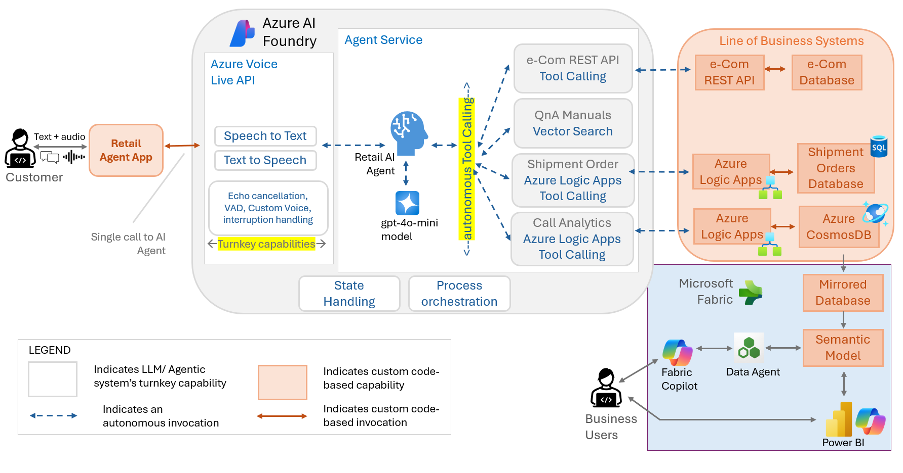

# Contoso Retail Assistant — Voice + Chat (Azure Voice Live API + Chainlit)

An interactive retail assistant that supports natural voice and text conversations using Azure Voice Live API. Built with Chainlit for responsive, real-time UI and robust audio handling.

It uses an Azure AI Foundry Project and an Agent in it that has tool actions configured - in this sample, it uses the Contoso Retail eCom APIs that are configured using the Swagger definition.

## 🛍 Use Case

Contoso's comprehensive in-store/online assistant with advanced automation capabilities:

### Core Shopping Features:
- Answer product questions (price, specs, availability)
- Place orders with full order management
- Product recommendations and search
- Vector-powered File Search for QnA on order processing, returns, payment issues, and policies

### Advanced Automation Features:
- **Automated Shipment Creation**: After order placement, the agent automatically creates shipment orders by:
  - Requesting delivery address from the user
  - Calling an Azure Logic App that creates a Shipment Order in Azure SQL Database
  - Providing shipment tracking information

- **Intelligent Conversation Analytics**: The agent autonomously analyzes conversations by:
  - Capturing the entire user conversation context
  - Sending conversation data to an Azure Logic App powered by GPT-4o
  - Performing comprehensive analysis including:
    - Key conversation information extraction
    - Customer sentiment analysis
    - Agent performance evaluation (how well the agent helped resolve issues)
  - Storing analytics data in Azure Cosmos DB for call log analytics and insights

### Example Queries:
- "What are the products in Winter wear?"
- "What are the products in Active Wear?"
- "I want to order 5 numbers of Product ID 24"
- "What is your return policy?"
- "How do I track my shipment?"
- "I need help with payment issues"

Optimized for hands-free, multi-turn conversations with live transcripts, spoken replies, and comprehensive backend automation.

## 🏗️ Solution Architecture



### Seamless Voice Enablement with Azure Voice Live API

Traditional approaches to building voice-enabled AI assistants would require significant architectural changes and custom development. However, with **Azure Voice Live API**, the same development team that built a text-based agent doesn't need to worry about making the agent itself voice-enabled—it becomes a seamless wrapper around their existing intelligent system.

Azure Voice Live API transforms this landscape by providing:

🎙️ **Single Integration Point** - The Voice Live API sits as an elegant wrapper around the existing agent, requiring minimal integration effort

🧠 **Zero Agent Modification** - The core Agentic System in Azure AI Foundry remains unchanged; all autonomous capabilities, tool actions, and business logic persist exactly as designed

🔄 **Turnkey Speech Capabilities** - Speech-to-text, text-to-speech, Voice Activity Detection (VAD), echo cancellation, and noise suppression come built-in without additional development

⚡ **Real-time Streaming** - Bidirectional audio streaming with minimal latency enables natural conversation flow

🛡️ **Enterprise Ready** - Built-in security, compliance, and scalability features suitable for production deployments

### Architecture Components

This application uses a modular architecture for better maintainability and reusability:

- **`app.py`** - Main Chainlit application and UI orchestration
- **`voicelive_client.py`** - Azure Voice Live API client with WebSocket handling
- **`utils.py`** - Utility functions for audio processing
- **Configuration** - Environment-based configuration management

### Key Features
- **Modular Components**: Each module has a single responsibility
- **Event-Driven Architecture**: Clean callback system for API events
- **Real-time Audio Processing**: Robust audio handling with buffering
- **Azure AD Auth**: Uses DefaultAzureCredential with `https://ai.azure.com/.default` scope
- **Voice Optimization**: 24kHz audio, semantic VAD, noise suppression, echo cancellation
- **Assistant Interruption**: Voice or text input cancels current response
- **Real-time UI**: Live transcripts and streaming responses
- **Optimized Placeholder Messages**: Simple placeholder text ("...") to avoid AI assistant confusion
- **Automated Shipment Processing**: Integration with Azure Logic Apps for order fulfillment
- **AI-Powered Conversation Analytics**: GPT-4o powered analysis with Cosmos DB storage
- **Vector File Search**: Intelligent QnA capabilities for policies and support topics

## 🔧 Recent Improvements

### Placeholder Message Optimization (Latest Update)
- **Issue Fixed**: The AI assistant was misinterpreting descriptive placeholder messages like "🎤 Listening..." and "[Voice input - processing transcript...]" as file upload indicators
- **Solution Implemented**: Simplified all placeholder messages to use neutral "..." text
- **Benefit**: Eliminates false "file upload" responses from the assistant, ensuring smooth voice conversations
- **Files Modified**: `app.py` - Updated `ensure_user_message_placeholder()`, `handle_conversation_thread_updated()`, `handle_user_input_transcript_done()`, and `handle_user_speech_stopped()` functions

## ✅ Prerequisites

- Python 3.10+
- An Azure AI Foundry project/agent configured for Voice Live
- Ability to obtain AAD tokens via DefaultAzureCredential (e.g., Azure CLI sign-in)

## 🤖 AI Agent Configuration

When setting up your AI Agent in Azure AI Foundry, use the following system prompt:

```
You are an AI Agent tasked with helping the customers of Contoso retail fashions with their shopping requirements. You have access to the following:
- APIs in contoso_retail_fashion_api that you need to call to respond to the user queries. 
- Once the customer purchases the merchandise, you will help them with a Shipment order based on the delivery address provided by them. 
- You will also use the File Search tool to help with QnA
- Once the customer concludes the call or indicates that the call can be ended, then send the entire conversation log to the ContosoRetailCallLogAnalytics_Tool tool action for analysis. The data you send should be like:
{
  "conversation": [
    {
      "role": "user",
      "message": "user input"
    },
    {
      "role": "assistant",
      "message": "agent response"
    },

    {
      "role": "user",
      "message": "Hey, what do you have in winter wear?"
    },
    {
      "role": "assistant",
      "message": "agent response sdasdasd "
    },
..... and so on ..... 
      ]
}

Important confirmation requirements:
- When the user places an order, always reconfirm with all the particulars (product details, quantities, prices, total amount) before creating the order. Wait for explicit user confirmation before proceeding.
- When creating the shipment order, always seek confirmation from the user about the destination address provided before creating it. Repeat back the complete address and ask for confirmation before proceeding.
```

This system prompt configures the agent to:
- Act as a Contoso retail fashion assistant
- Use the retail fashion APIs for product queries
- Handle shipment orders post-purchase with Azure Logic App integration
- Utilize Vector File Search for QnA on policies, returns, payments, and support topics
- **Automated conversation analytics** using GPT-4o powered Azure Logic App
- **Confirm order details** before placing orders
- **Verify shipping addresses** before creating shipments
- **Capture and analyze** complete conversation logs for sentiment and performance insights

See the screenshot of the Agent existing in Azure AI Foundry Agent Service:


## 📊 Call Log Analytics Configuration

The conversation analytics feature uses a separate Azure Logic App with GPT-4o to analyze call quality and extract insights. This Logic App uses the following system prompt and function schema:


### Call Log Evaluation System Prompt:
```
You are a Call Center Quality Evaluator AI for Contoso Retail, a fashion and apparel company.

[Your Task]
- Analyze the customer service call transcript and extract the following parameters: call_reason, product, customer_satisfaction, customer_sentiment, call_rating (1–5), call_rating_justification, and call_date.

[Evaluation Guidelines]
- Judge the call based on tone, language, and resolution of the issue.
- Identify the fashion/apparel product discussed if applicable (e.g., Men's Shirts, Women's Dresses, Shoes, Accessories, etc.) - this field can be null for general inquiries.
- If the customer is frustrated, confused, or expresses dissatisfaction, rate the sentiment accordingly.
- Use real-world judgment based on typical customer service scenarios in fashion retail (e.g., size issues, quality complaints, delivery problems, returns/exchanges).
```

### Evaluation Function Schema:
The Logic App uses a structured function call `evaluate_call_log` that extracts:

- **call_reason**: Categorized from 50+ predefined retail scenarios (Order status inquiry, Size exchange request, Defective item received, etc.)
- **product**: Specific fashion/apparel product discussed (optional)
- **customer_satisfaction**: Overall satisfaction level assessment
- **customer_sentiment**: Emotional tone analysis
- **call_rating**: Numerical rating (1-5 scale)
- **call_rating_justification**: Key reasoning for the rating
- **call_date**: Extracted call timestamp

This structured analysis enables comprehensive call center analytics, quality monitoring, and performance insights stored in Azure Cosmos DB.

### Complete Logic App Configuration:
```json
{
  "frequency_penalty": 0,
  "function_call": "auto",
  "functions": [
    {
      "description": "Evaluate call log for a Contoso Retail fashion and apparel customer service call and rate the call",
      "name": "evaluate_call_log",
      "parameters": {
        "properties": {
          "call_reason": {
            "description": "The reason for the customer call related to fashion and apparel products, orders, or service",
            "type": "string"
          },
          "product": {
            "description": "The specific fashion/apparel product being discussed (optional - may be null for general inquiries)",
            "type": "string"
          },
          "customer_satisfaction": {
            "description": "The satisfaction level of the customer during the call",
            "type": "string"
          },
          "customer_sentiment": {
            "description": "The sentiment of the customer during the call",
            "type": "string"
          },
          "id": {
            "description": "Unique identifier of the call log",
            "type": "string"
          },
          "call_rating": {
            "description": "The rating of the call on a scale of 1 to 5",
            "type": "number"
          },
          "call_rating_justification": {
            "description": "The key reason for the given rating",
            "type": "string"
          },
          "call_date": {
            "description": "Date of the call in YYYY-MM-DD format. extracted from the call log",
            "type": "string"
          }
        },
        "required": [
          "call_reason",
          "customer_satisfaction",
          "customer_sentiment",
          "id",
          "call_rating",
          "call_rating_justification",
          "call_date"
        ],
        "type": "object"
      }
    }
  ],
  "max_tokens": 1000,
  "messages": [
    {
      "role": "system",
      "content": "You are a Call Center Quality Evaluator AI for Contoso Retail, a fashion and apparel company.\n\n[Your Task]\n- Analyze the customer service call transcript and extract the following parameters: call_reason, product, customer_satisfaction, customer_sentiment, call_rating (1–5), call_rating_justification, and call_date.\n\n[Evaluation Guidelines]\n- Judge the call based on tone, language, and resolution of the issue.\n- Identify the fashion/apparel product discussed if applicable (e.g., Men's Shirts, Women's Dresses, Shoes, Accessories, etc.) - this field can be null for general inquiries.\n- If the customer is frustrated, confused, or expresses dissatisfaction, rate the sentiment accordingly.\n- Use real-world judgment based on typical customer service scenarios in fashion retail (e.g., size issues, quality complaints, delivery problems, returns/exchanges).\n- The call_reason must be from the values mentioned below:\n[Order status inquiry,Delayed delivery,Wrong item delivered,Size exchange request,Color/style exchange,Defective item received,Item damaged in shipping,Missing items from order,Return merchandise authorization,Refund status inquiry,Store credit inquiry,Gift card issue,Loyalty points question,Size guide assistance,Product availability check,Restocking notification request,Price match request,Discount code not working,Payment processing issue,Credit card declined,Website login problem,Mobile app technical issue,Account lockout,Password reset request,Order cancellation request,Modify shipping address,Change payment method,Rush delivery request,International shipping inquiry,Sizing consultation,Style recommendation,Personal shopper service,Alteration services inquiry,Care instructions question,Product authenticity verification,Wholesale inquiry,Bulk order request,Corporate account setup,Student discount verification,Military discount verification,Senior citizen discount,Newsletter subscription issue,SMS alert setup,Email notification problem,Privacy policy question,Terms of service inquiry,Complaint about store staff,Online chat technical issue,Callback request,Escalation to supervisor,Feedback on service quality,Product review submission,Fashion trend inquiry,Seasonal collection question,Pre-order inquiry,Wishlist synchronization issue,Cart abandonment follow-up,Out of stock notification,Back in stock alert]"
    },
    {
      "content": "@{triggerBody()}   the id of this call log is @{guid()} and the call date is: @{utcNow()}",
      "role": "user"
    }
  ],
  "presence_penalty": 0,
  "stop": null,
  "temperature": 0,
  "top_p": 0.95
}
```

This configuration shows the complete GPT-4o function calling setup used in the Azure Logic App for automated call analysis and quality evaluation.

### Sample Output - Azure Cosmos DB Document:
The Logic App processes conversations and stores the analytics results in Azure Cosmos DB. Here's an example of the structured output:

```json
{
    "call_reason": "Refund status inquiry",
    "product": "Women's Navy Dress",
    "customer_satisfaction": "Very Dissatisfied",
    "customer_sentiment": "Happy",
    "id": "e54ac9c3-b368-41b9-835c-1e569aaf26b9",
    "call_rating": 5,
    "call_rating_justification": "The interaction covered refund processing stages thoroughly; however, customer remained happy about refund status inquiry.",
    "call_date": "2025-08-24",
    "_rid": "0o0QAPdDlEIJAAAAAAAAAA==",
    "_self": "dbs/0o0QAA==/colls/0o0QAPdDlEI=/docs/0o0QAPdDlEIJAAAAAAAAAA==/",
    "_etag": "\"04007cc4-0000-4700-0000-68b9a54d0000\"",
    "_attachments": "attachments/",
    "_ts": 1756996941
}
```

This document demonstrates:
- **Structured Analytics**: Clear categorization of call reason and product
- **Multi-dimensional Assessment**: Both satisfaction level and sentiment analysis
- **Quality Scoring**: Numerical rating with detailed justification
- **Metadata Integration**: Cosmos DB system fields for document management
- **Temporal Tracking**: Call date and timestamp for analytics reporting


## 🚀 Setup & Run

### 1. Environment Configuration

Environment variables (in a `.env` at repo root). Start by copying the template:

```powershell
Copy-Item .env.example .env -Force
```

Then set these variables:
- `AZURE_VOICE_LIVE_ENDPOINT` (e.g., `https://<your-endpoint>.api.cognitive.microsoft.com`)
- `AZURE_VOICE_LIVE_API_VERSION` (defaults to `2025-05-01-preview`)
- `AI_FOUNDRY_PROJECT_NAME`
- `AI_FOUNDRY_AGENT_ID`

#### Optional Voice Configuration:
- `AZURE_TTS_VOICE_NAME` (defaults to `"en-IN-AartiIndicNeural"`)
  - Examples: `"en-US-AriaNeural"`, `"en-US-JennyNeural"`, `"en-GB-SoniaNeural"`, `"fr-FR-DeniseNeural"`
  - See [Azure TTS voice gallery](https://docs.microsoft.com/azure/cognitive-services/speech-service/language-support#text-to-speech) for more options

### 2. Authentication

Sign in for AAD token (one of):
- Azure CLI: `az login`
- Managed identity or VS Code/Azure sign-in also works with DefaultAzureCredential

### 3. Install Dependencies

```powershell
pip install -r requirements.txt
```

### 4. Start the Application

```powershell
chainlit run app.py
```

Open the Chainlit URL shown in the terminal (typically http://localhost:8000).

## 🎤 How to Use

- Click "🎙 Start Voice" to begin a voice session. Speak naturally; server VAD detects turns.
- The assistant replies with audio and text. User messages appear right‑aligned; assistant left.
- You can also type. Sending text cancels any ongoing assistant audio and triggers a fresh reply.
- Click "🛑 Stop Voice" to end the voice session (you can continue typing if desired).

## ✨ Features

### Core Voice & Chat Features:
- Real-time voice conversation with server VAD and noise suppression
- Echo control: server echo cancellation plus half‑duplex mic gating with tail cooldown
- Live transcripts for user speech and assistant replies
- Typed chat supported; safe session-ready gating to avoid early drops
- Immediate interruption on new input (voice or text) to keep the flow natural
- Optimized placeholder messages that don't confuse the AI assistant

### Advanced Business Features:
- **Automated Order Fulfillment**: Seamless integration with Azure Logic Apps for shipment creation in Azure SQL Database
- **Intelligent QnA Support**: Vector-powered File Search for policies, returns, and payment assistance
- **AI-Powered Analytics**: GPT-4o driven conversation analysis with sentiment scoring and performance evaluation stored in Azure Cosmos DB
- **End-to-End Order Management**: From product inquiry to shipment tracking with full automation

## 🧭 High-level Flow

### Voice & Chat Flow:
1) Chainlit UI ←→ WebSocket client
2) Azure Voice Live API session configured (VAD, noise/echo, voice)
3) Mic audio → `input_audio_buffer.append`
4) Server transcribes; user transcript is rendered with simple "..." placeholder
5) Agent responds; audio frames stream back and are played
6) Mic is temporarily gated during assistant audio and for a short cooldown

### Business Process Flow:
7) **Product Queries**: Agent searches product catalog via retail APIs
8) **Order Processing**: Agent places order and requests delivery address
9) **Shipment Creation**: Azure Logic App creates shipment record in Azure SQL Database
10) **QnA Support**: Vector File Search provides policy and support information
11) **Conversation Analytics**: At conversation end, full dialogue sent to GPT-4o powered Logic App
12) **Analytics Storage**: Sentiment, performance metrics, and insights stored in Azure Cosmos DB

## 🛠 Troubleshooting

- "Could not reach the server" banner: Chainlit UI reconnect notice; if conversation continues, you can ignore. Refresh if it persists.
- No audio capture: ensure mic permission granted and the correct input device is active.
- Self‑interruptions/echo: increase cooldown settings in the session config.
- Assistant mentions file uploads: This should be resolved with the latest placeholder message optimization. If it persists, check that all placeholder messages use simple "..." text.
- Typed message ignored on first try: ensure the app shows "Connected to Azure Voice Live API" before sending; the app already waits briefly for session readiness.

## ☁️ Azure Services Integration

This solution leverages multiple Azure services for a comprehensive retail assistant experience:

### Core AI Services:
- **Azure AI Foundry**: Hosts the conversational agent with tool actions
- **Azure Voice Live API**: Enables real-time voice conversations with WebSocket streaming
- **Azure Cognitive Services**: Provides TTS/STT capabilities with advanced voice features

### Backend Automation:
- **Azure Logic Apps**: 
  - Shipment order creation workflow
  - GPT-4o powered conversation analytics pipeline
- **Azure SQL Database**: Stores shipment orders and fulfillment data
- **Azure Cosmos DB**: Stores conversation analytics, sentiment analysis, and performance metrics

### AI-Powered Features:
- **Vector File Search**: Intelligent document search for policies and support
- **GPT-4o Analytics**: Advanced conversation analysis including sentiment and performance scoring
- **Retail APIs**: Product catalog integration with search and ordering capabilities
- **Call Quality Evaluation**: Automated analysis of 50+ call reason categories including:
  - Order Management: Status inquiry, delayed delivery, wrong items, cancellations
  - Returns & Exchanges: Size/color exchanges, defective items, RMA requests
  - Technical Support: Website issues, mobile app problems, account assistance
  - Customer Service: Sizing consultation, style recommendations, discount inquiries
  - Business Services: Wholesale inquiries, corporate accounts, bulk orders

### Advanced Analytics & Data Lake:
- **Microsoft Fabric Integration**: Call analytics data is mirrored from Azure Cosmos DB to a Data Lake in Microsoft Fabric
- **Copilot in Fabric**: Enables advanced insights and analysis of conversation patterns, trends, and business intelligence
- **Data Lake Analytics**: Comprehensive reporting and dashboard creation from mirrored call center data


#### Creating Data Agents for Business Intelligence

Once the call analytics data is mirrored to Microsoft Fabric, **Data Engineers** or **Power Users from Business** can create specialized Data Agents to surface insights from the conversation data. This process involves:

1. **Data Table Selection**: Choosing relevant tables from the mirrored call analytics database
2. **Few-Shot Examples**: Providing sample queries and expected responses to train the agent
3. **AI Instructions**: Defining specific prompts and guidelines for data analysis
4. **Testing & Validation**: Ensuring the Data Agent can accurately surface insights and answer business questions
5. **Publishing**: Making the Data Agent available through the Copilot experience in Microsoft Fabric


The screenshot above demonstrates how business users can ask natural language questions and receive intelligent insights from the Data Agent, making complex analytics accessible to non-technical stakeholders.

#### Business User Experience with Copilot in Microsoft Fabric

Once the Data Agent is published by the Data Engineer or Power User, **business users can access it through Copilot in Microsoft Fabric** to reason over the analytics data. This democratizes data access and enables self-service business intelligence.


Business users can now:
- Ask natural language questions about call center performance
- Get insights on customer satisfaction trends
- Analyze product-specific feedback patterns
- Discover emerging issues and opportunities
- Generate reports without technical expertise

**Example Business Queries**:
- "What are the top 3 reasons customers call about returns this month?"
- "How has customer satisfaction improved for Women's Navy Dress refunds?"
- "Which products have the highest call ratings?"
- "Show me sentiment trends for technical support calls"

#### Power BI Interactive Reports from OneLake

Beyond natural language queries through Copilot, the call analytics data in Microsoft Fabric OneLake can be surfaced through **Power BI Interactive Reports** for comprehensive visual analytics and executive dashboards.

**Trending Call Reasons Over Time Analysis**:


**Detailed Call Reason Analysis**:


These Power BI reports enable:
- **Executive Dashboards**: High-level KPIs and trends for leadership teams
- **Operational Analytics**: Detailed breakdowns for call center managers
- **Trend Analysis**: Historical patterns and seasonal variations in call reasons
- **Performance Monitoring**: Track customer satisfaction and agent effectiveness over time
- **Interactive Exploration**: Drill-down capabilities for detailed investigation
- **Automated Reporting**: Scheduled reports for stakeholders across the organization

This multi-layered approach provides both **conversational AI insights** through Copilot and **comprehensive visual analytics** through Power BI, catering to different user preferences and analytical needs.

This extended architecture enables enterprise-scale analytics with:
- **Real-time Mirroring**: Automatic data synchronization from Cosmos DB to Fabric Data Lake
- **Advanced Analytics**: Leverage Copilot in Fabric for intelligent insights and pattern recognition
- **Business Intelligence**: Create comprehensive dashboards and reports from conversation data
- **Scalable Data Processing**: Handle large volumes of call analytics for enterprise reporting

This architecture provides scalable, secure, and intelligent retail assistance with comprehensive analytics and automation.

## 📁 Project Structure

- `app.py` — Main Chainlit application with optimized placeholder handling
- `voicelive_client.py` — Azure Voice Live API WebSocket client
- `utils.py` — Audio processing utilities
- `chainlit.md` — Chainlit UI welcome message
- `requirements.txt` — Python dependencies
- `images/` — Documentation assets
- `logs/` — Runtime logs (if configured)

## 🔒 Notes on Auth & Data

- Uses Azure AD tokens (DefaultAzureCredential) with scope `https://ai.azure.com/.default`.
- Token is sent as `Authorization: Bearer` and as `agent-access-token` in the WS query.
- Audio and text are streamed to Azure Voice Live API. Review your organization's privacy/compliance requirements before production use.

## 🔄 Version History

### Latest Changes
- **Placeholder Message Fix**: Simplified all user message placeholders to "..." to prevent AI assistant from misinterpreting them as file upload indicators
- **Improved User Experience**: Eliminated false "file upload" responses during voice conversations
- **Code Optimization**: Updated event handlers in `app.py` for better message flow management

---

Made with ❤️ using Chainlit and Azure Voice Live API for a smooth retail voice experience.
